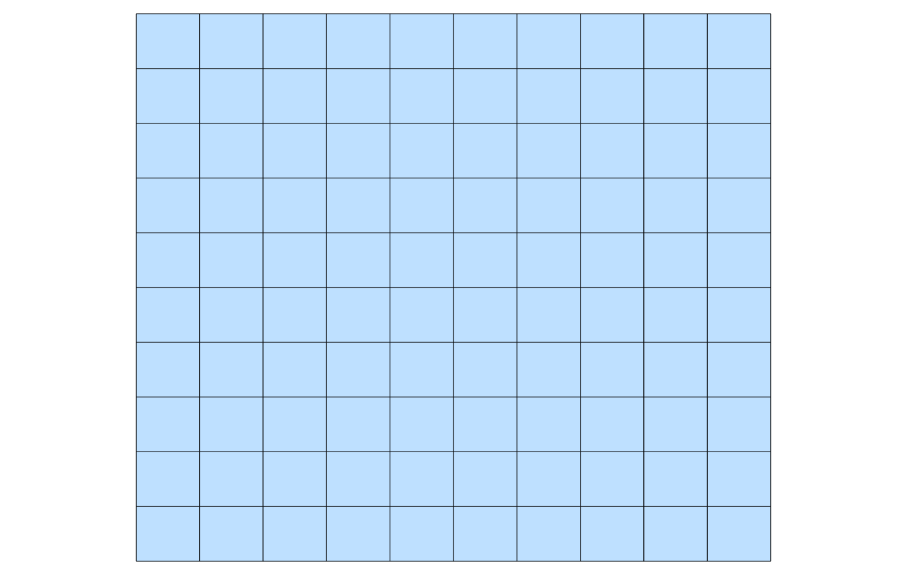
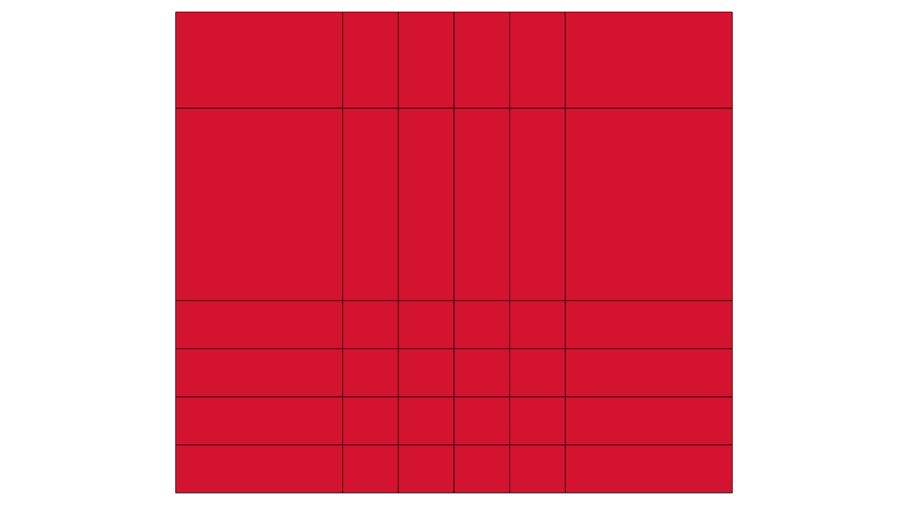
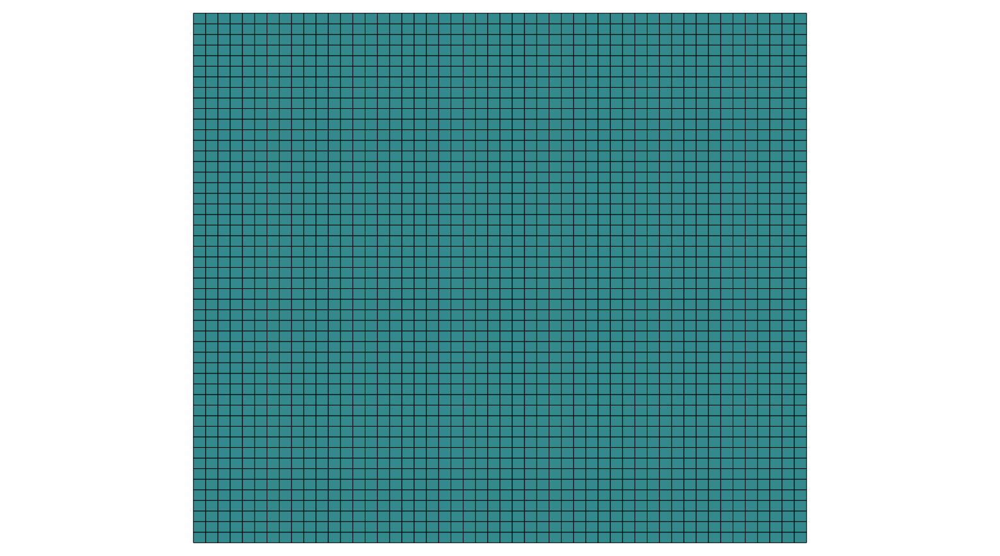
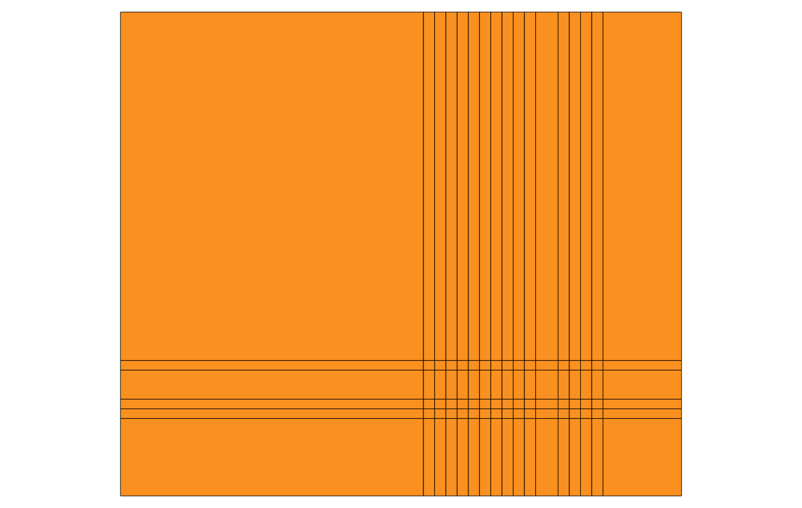
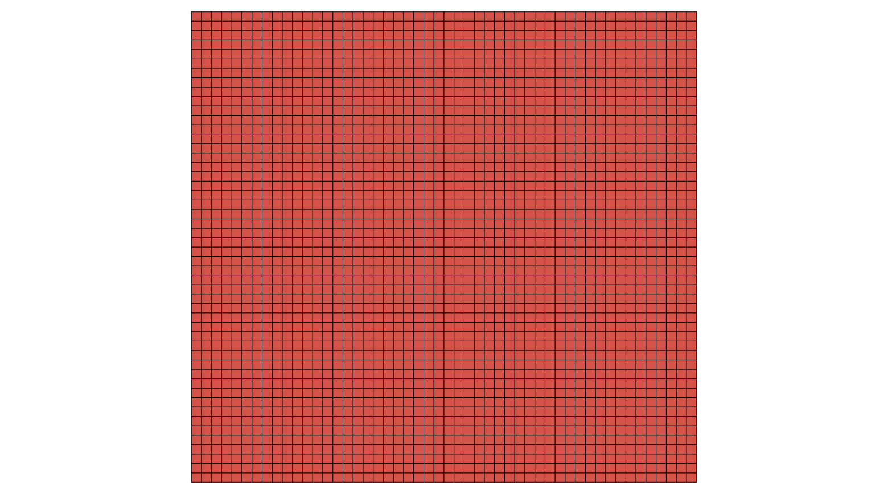
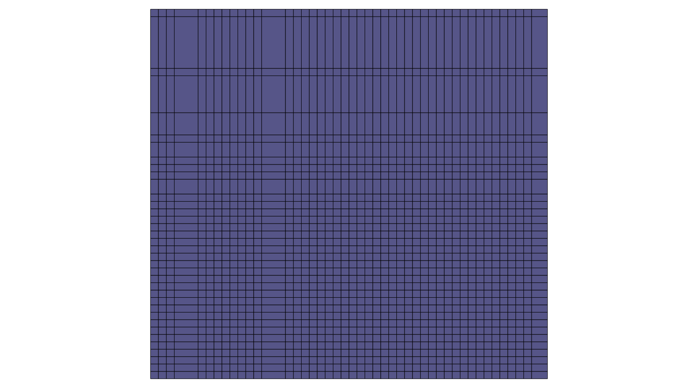
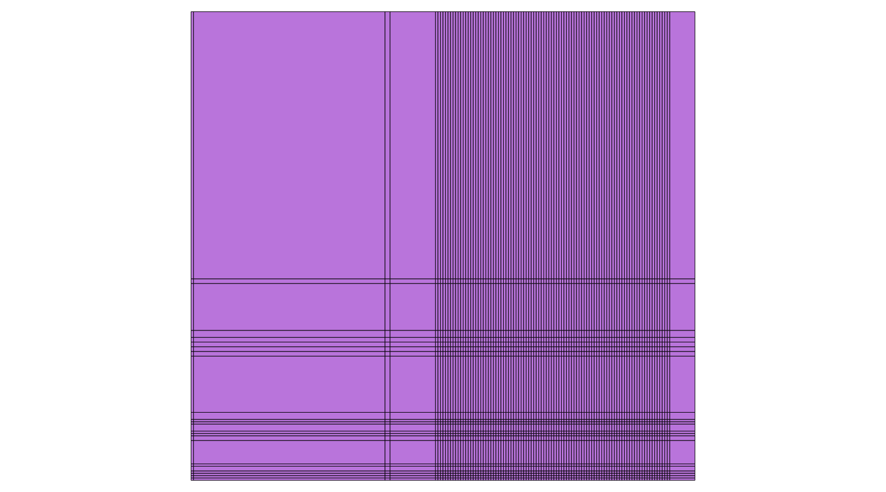

# Resultados de testes

**Tabela Comparativa**

|   | Granularidade(n x n)                          | Granularidade Após | Validação quantidade objetos | Validação de celulas pelo QGIS | prefixo arquivo |
|---|:------------:|:------------:|:------------:|:------------:|:------------:|
| Municipios |   `10x10`, `50x50`, `100x100`   |  `6x6`, `17x6`, `100x100`            |              |    Validação simples          |  mun-{dgeo, antes, deps}-nxn             |             
| Alertas |    `50x50`, `100x100`  |  `50x50`, `100x100`    |               |    Validação simples                       | ale-{dgeo, antes, deps}-nxn              |              
| Rodovia |     `50x50`, `200x200`          |  `45x36`, `98x23`            |     |    Validação simples               | rod-{dgeo, antes, deps}-nxn             | 

## Municipios

* __10x10__ 

* __50x50__ 

## Rodovia

* __50x50__ 

* __200x200__ 

